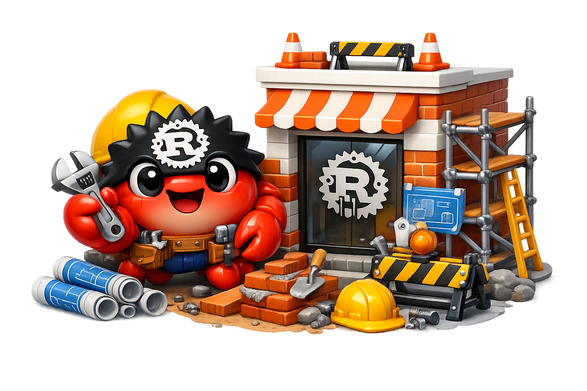

  

<h1 align="center">RustUse (Under Construction)</h1>

  <strong>Composable facades of primitive Rust utility crates for fellow crustaceans.</strong>

  <a href="https://rustuse.org">Documentation</a>

RustUse is an open-source collection of small, focused Rust utility crates organized into practical `use-*` facades.

Each facade is intended to stay narrow, documented, tested, and easy to compose without pulling in heavy frameworks or unnecessary dependencies.

> [!WARNING]
> RustUse is under active development.
>
> Any RustUse crate below version `0.3.0` is experimental and should not be used in production.

## Principles

RustUse favors:

- small crates with few or no dependencies
- clear APIs
- practical primitives
- focused workspaces
- Rust 2024 edition
- strong documentation
- meaningful tests
- composability over framework design
- dual MIT or Apache-2.0 licensing

## Contributing

Contributors and maintainers are welcome.

Useful contribution areas include crate design, documentation, examples, tests, benchmarks, API review, CI/CD, and release workflows.

## License

RustUse projects are available under either the MIT License or the Apache License, Version 2.0, at your option.
